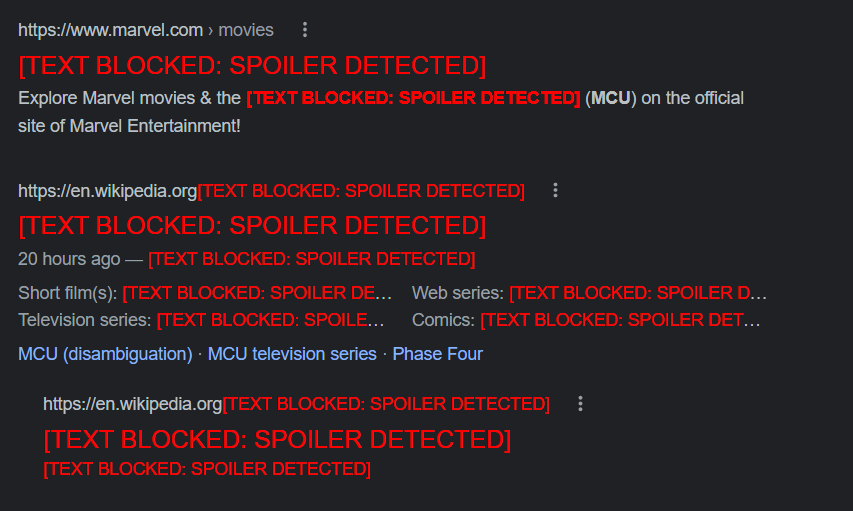

# spoilers
Recently Peaky Blinder new season has come and my chrome is filled with its spoilers which is bad and again Doctor Strange in the Multiverse of Madness is coming soon and i don't want to spoil that so this chrome extension will help me survive through this XD

# Features

- **Spoiler Blocking**: Searches entire web page and replaces Spoilers with text `##[TEXT BLOCKED: SPOILER DETECTED]`
- **Image Blurring**: Blurs the neighbouring Images which are relevant and might reveal the Spoiler information.

# How It Works

 

# How To Use?

- Clone this repository or download as a zip file
- Incase you downloaded as a zip, unzip it
- Open Google Chrome
- Go to `chrome://extensions`
- Enable Developer Mode at top right corner.
- Click on `Load Unpacked` which you can see in the top left side.
- Select the path where you cloned/downloaded this project.
- That's all XD Try opening any [MCU and Peaky Blinders Spoiler](https://www.google.com/search?q=MCU+spoilers&rlz=1C1CHZN_enIN989IN989&oq=MCU+spoilers&aqs=chrome..69i57j69i60l2.6217j0j7&sourceid=chrome&ie=UTF-8) page to enjoy the blocking power.
